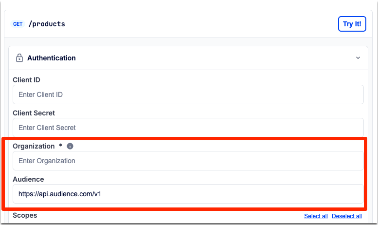

# Spec renderer Extensions

## x-kong-client-credentials-config

Allows to specify additional request parameters (body) to be send to auth2 token endpoint when using client credentials flow.




example:
```yaml
components:
  securitySchemes:
    OAuth2ClientCredentials:
      type: oauth2
      # extension
      x-kong-client-credentials-config:
        extraTokenRequestParameters:
          - name: organization
            label: Organization
            description: The organization identifier
            omitIfEmpty: true
          - name: audience
            label: Audience
            required: true
            value: https://api.audience.com/v1

      flows:
        clientCredentials:
          tokenUrl: https://example.com/oauth2/token
```

`extraTokenRequestParameters` - array of additional request parameters to be sent to token endpoint.

each parameter can have the following properties:

| Property | Description | Default |
|----------|-------------|---------|
| `name` | Name of the parameter | Required |
| `label` | Label of the parameter, if not provided, `name` will be used | `name` value |
| `description` | Description of the parameter, shown as tooltip | `''` |
| `value` | Default value of the parameter | `''` |
| `omitIfEmpty` | If true, the parameter will be omitted in the request if the value is empty | `false` |
| `required` | If true, the parameter is required | `false` |
| `readOnly` | If true, the user cannot edit value of the parameter | `false` |
| `hidden` | If true, the parameter will be hidden from the UI but sent to the token endpoint | `false` |

