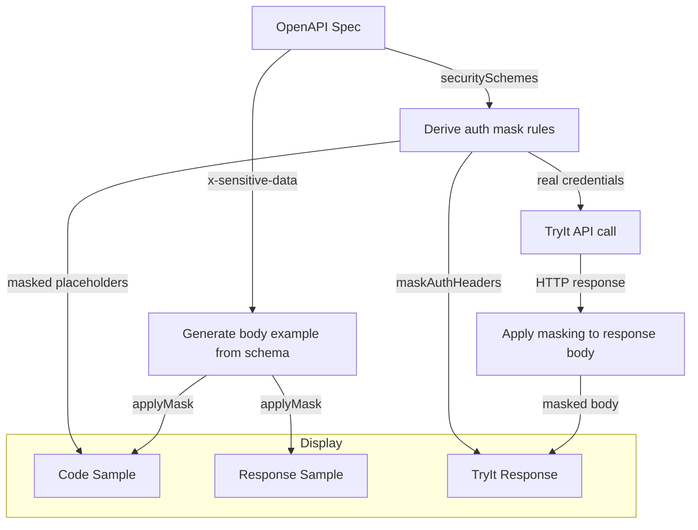

# Spec renderer Extensions

## x-kong-client-credentials-config

Allows to specify additional request parameters (body) to be send to auth2 token endpoint when using client credentials flow.


example:
```yaml
components:
  securitySchemes:
    OAuth2ClientCredentials:
      type: oauth2
      # extension
      x-kong-client-credentials-config:
        extraTokenRequestParameters:
          - name: organization
            label: Organization
            description: The organization identifier
            omitIfEmpty: true
          - name: audience
            label: Audience
            required: true
            value: https://api.audience.com/v1

      flows:
        clientCredentials:
          tokenUrl: https://example.com/oauth2/token
```

`extraTokenRequestParameters` - array of additional request parameters to be sent to token endpoint.

each parameter can have the following properties:

| Property | Description | Default |
|----------|-------------|---------|
| `name` | Name of the parameter | Required |
| `label` | Label of the parameter, if not provided, `name` will be used | `name` value |
| `description` | Description of the parameter, shown as tooltip | `''` |
| `value` | Default value of the parameter | `''` |
| `omitIfEmpty` | If true, the parameter will be omitted in the request if the value is empty | `false` |
| `required` | If true, the parameter is required | `false` |
| `readOnly` | If true, the user cannot edit value of the parameter | `false` |
| `hidden` | If true, the parameter will be hidden from the UI but sent to the token endpoint | `false` |

---

## x-sensitive-data

Marks a schema property as sensitive so its value is masked in displayed examples and API responses.
Masking is display-only — sensitive values are replaced with a placeholder in all displayed output.

### Mask strategies

| Strategy | Result | Use when |
|----------|--------|----------|
| `full` | `••••••` | Hide the value entirely |
| `remove` | *(field omitted)* | Remove the field from the example |
| `hash` | `3d2a1f8c` | Show that two values are equal without revealing either |
| `regex` | partial mask (e.g. `••••••@example.com`) | Mask only part of the value |

### Usage

Add `x-sensitive-data` to any schema property:

```yaml
components:
  schemas:
    LoginRequest:
      type: object
      properties:
        username:
          type: string
          example: alice
        password:
          type: string
          x-sensitive-data:
            mask: full        # displayed as ••••••
        email:
          type: string
          x-sensitive-data:
            mask: regex
            pattern: ^[^@]+  # displayed as ••••••@example.com
        apiToken:
          type: string
          x-sensitive-data:
            mask: hash        # displayed as 8-char hex fingerprint e.g. 3d2a1f8c
        internalNote:
          type: string
          x-sensitive-data:
            mask: remove      # field omitted from example entirely
```

### Where masking is applied

| Surface | What is masked |
|---------|----------------|
| Request body example (code samples) | Properties with `x-sensitive-data` |
| Response body example (code samples) | Properties with `x-sensitive-data` |
| TryIt request body | Properties with `x-sensitive-data` — shown as read-only masked view; click **Unmask** to edit |
| TryIt response body | Properties with `x-sensitive-data` |
| TryIt response headers | Auth headers from `securitySchemes` (automatic, no annotation needed) |
| Code sample auth headers/query | Auth values from `securitySchemes` (automatic) |

> **Note:** TryIt API calls always send the **real** credential values. Masking only affects what is displayed on screen.

### Toggle

Each panel that contains masked data shows a **visibility toggle** (masked by default). Click **Show sensitive data** to reveal real values inline; click **Hide sensitive data** to re-mask. The toggle is hidden when no masking is active for that panel.

### How it works



**Step by step:**

1. **Code samples** — The renderer reads the operation's `securitySchemes` and derives auth mask rules that replace real header/query values with `••••••`.

2. **Body examples** — The schema is walked to build an example object. For each property with `x-sensitive-data`, the configured mask strategy is applied before the value is added to the example. This covers both request and response body samples shown in code snippets.

3. **TryIt request** — The real credential values are always sent so the API call works correctly. Masking does not affect the actual HTTP request.

4. **TryIt response body** — After receiving a response, the matching response schema is looked up (exact status code → wildcard e.g. `4XX` → `default`). The parsed response JSON is then recursively walked and any property marked with `x-sensitive-data` is masked.

5. **TryIt response headers** — Response headers are checked against the auth mask rules. Any header name matching a rule (e.g. `Authorization`) is replaced with its placeholder before display.

---

## x-tagGroups

`x-tagGroups` is an OpenAPI extension for organizing endpoint navigation by named tag groups.

The renderer follows strict grouping behavior:

- `x-tagGroups` must be defined as a top-level OpenAPI extension.
- Every tag that should appear in endpoint navigation must be listed in an `x-tagGroups[].tags` array.
- When `x-tagGroups` is active, operations with unlisted tags and untagged operations are hidden from the endpoint navigation.
- Tags listed in `x-tagGroups` that do not exist in the OpenAPI `tags` list or on any operation are skipped and a warning is emitted.
- `x-tagGroups` only scopes endpoint navigation. Other navigation sections, such as schemas or articles, are not grouped by this extension.

Example:

```yaml
openapi: 3.0.3
tags:
  - name: Orders
  - name: Payments
x-tagGroups:
  - name: Commerce APIs
    tags:
      - Orders
      - Payments
paths:
  /orders:
    get:
      tags:
        - Orders
      summary: List orders
      responses:
        '200':
          description: OK
```
